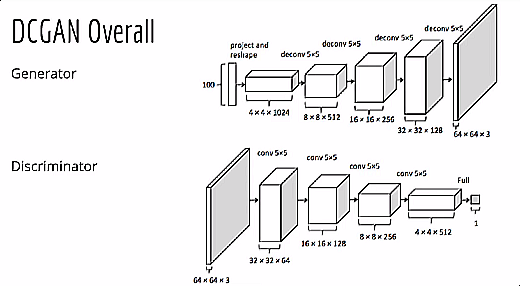
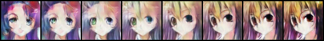
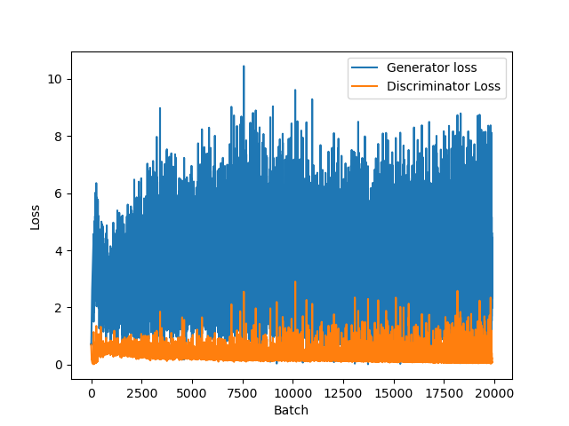

# Anime-Face-Generation
In this various models will be used to generate Anime Faces starting with GANs
## DCGANs
Exact Architecure has been used in the model as mentioned in the paper [^1]
### Architecure

### Results
The main result is in the notebook
#### Interpolation between two Random Instances

#### Loss Curve during Training

### References
1. [Unsupervised Representation Learning with Deep Convolutional Generative Adversarial Networks](https://arxiv.org/abs/1511.06434)
2. [DCGAN for classroom images](https://neuro.cs.ut.ee/wp-content/uploads/2018/02/DCGAN.pdf)
