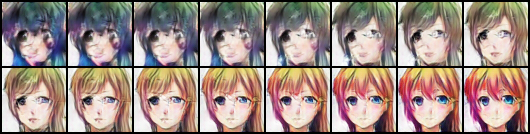

# Anime-Face-Generation
In this various models will be used to generate Anime Faces starting with Genrative Models. 
As of now DCGAN is done, will upload W-GAN soon.
## Dataset
The Dataset for this was taken from [Anime Face Dataset](https://www.kaggle.com/datasets/splcher/animefacedataset)
## DCGANs 
The notebook was run on Kaggle  
Exact Architecure has been used in the model as mentioned in the paper [1.] , adding an layer to discriminator did improve the quality (visually) but any other hyperparameter tuning worsened the quality.
### Architecure

### Results

#### Interpolation between two Random Instances

#### Loss Curve during Training

## WGANs with generator same as DCGAN (In progess: A run with more Epochs is required)
This was also run on Kaggle  
Exact Architecure has been used in the model as mentioned in the paper [3.] [1.] , with changed Loss function and removal of sigmoid in Discriminator(Critic)
### Loss Function
### Results

#### Interpolation between two Random Instances

#### Loss Curve during Training

### References
1. [Unsupervised Representation Learning with Deep Convolutional Generative Adversarial Networks](https://arxiv.org/abs/1511.06434)
2. [DCGAN for classroom images](https://neuro.cs.ut.ee/wp-content/uploads/2018/02/DCGAN.pdf)
3. [Wasserstein GAN](https://arxiv.org/abs/1701.07875)
